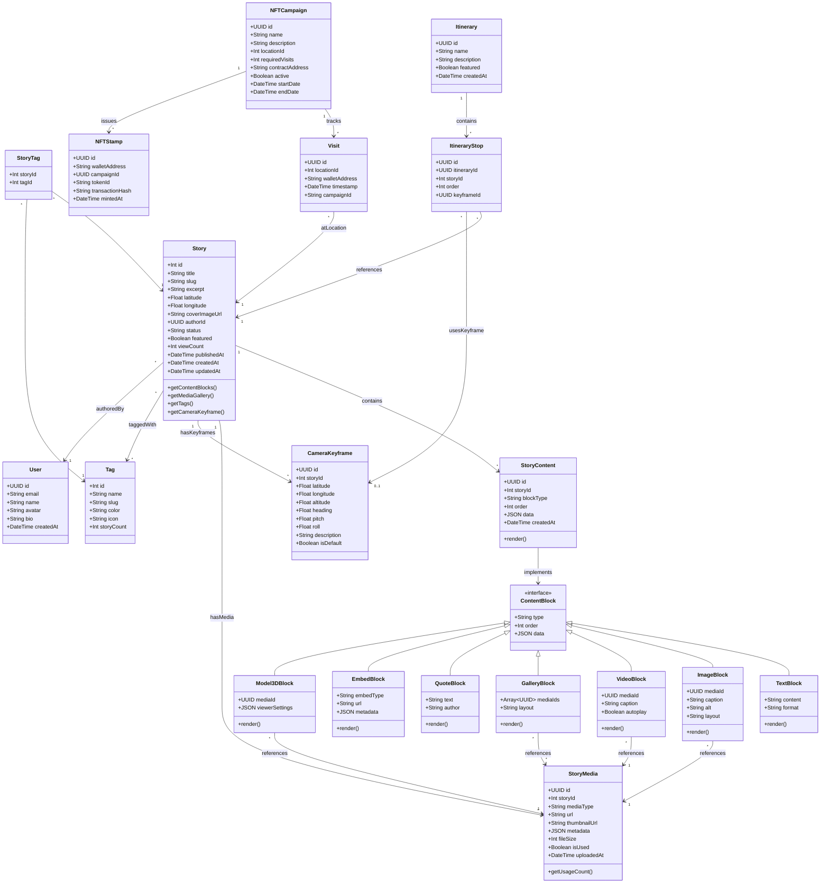
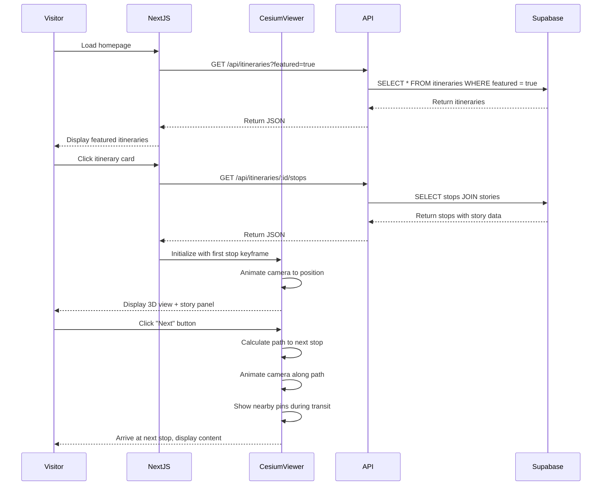
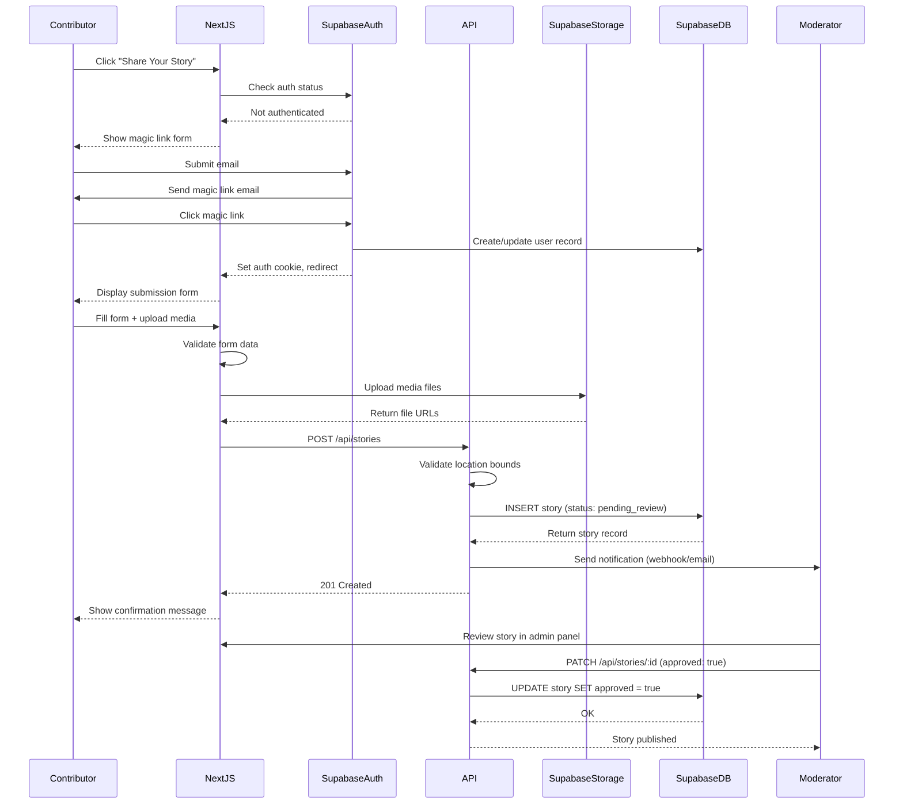
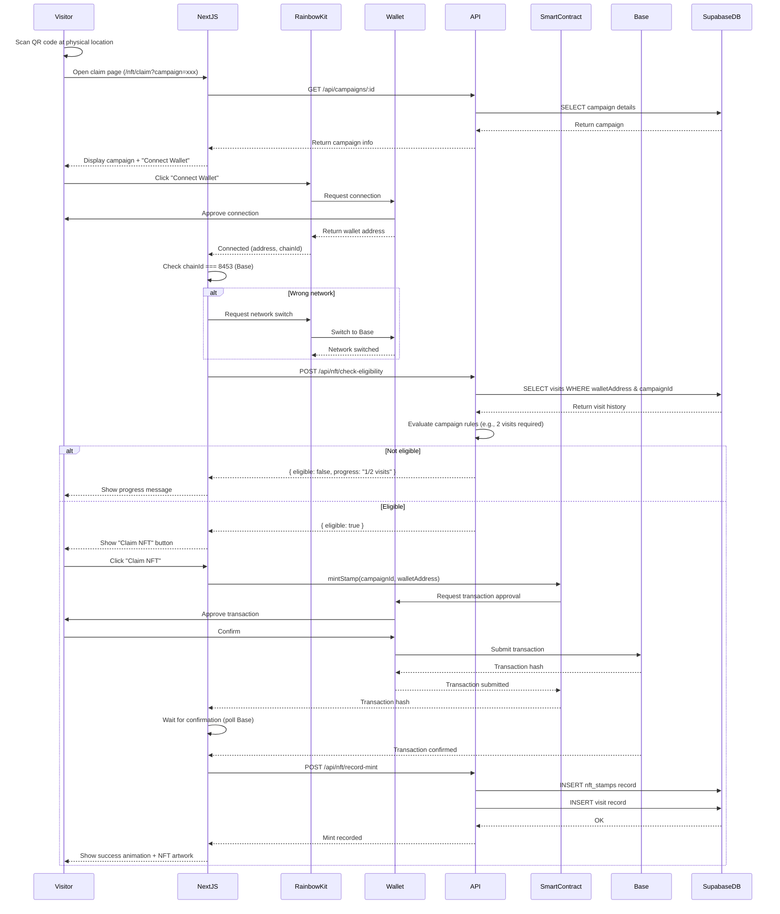
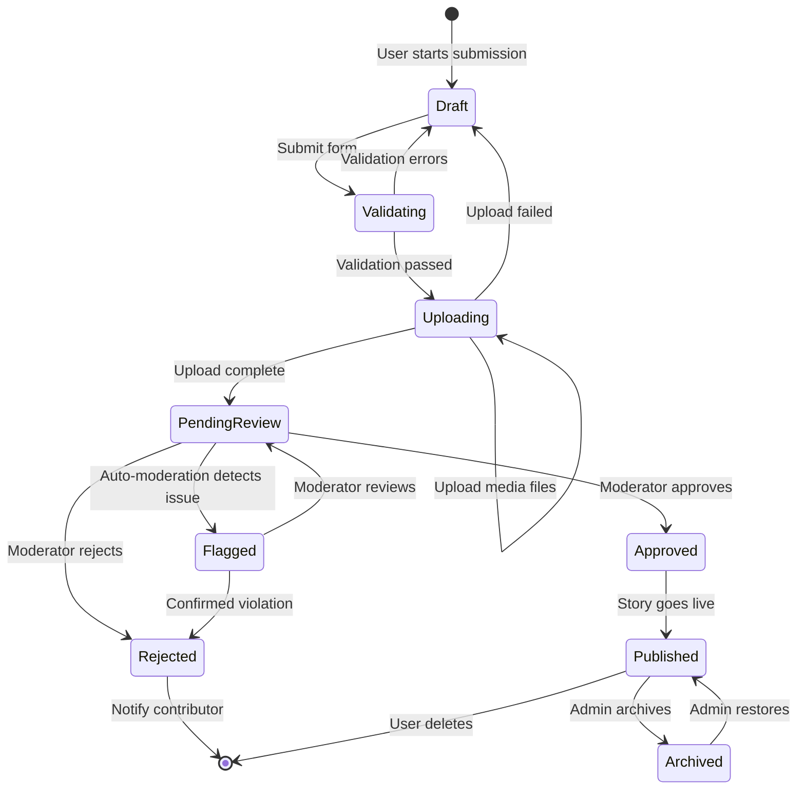
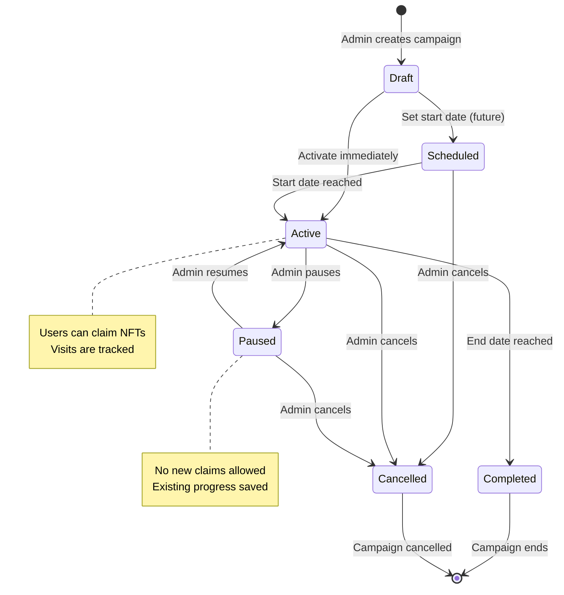

[https://docs.fileverse.io/0x86A3a4404EFCF8CEcC492E310015d349A035b96b/6\#key=DpO\_K6hOcTHxV\_2EnTywtpP3KJkgmgr8ydAB2AtPxGFi5X6h0X1xLEAWGw1AiGJF](https://docs.fileverse.io/0x86A3a4404EFCF8CEcC492E310015d349A035b96b/6#key=DpO_K6hOcTHxV_2EnTywtpP3KJkgmgr8ydAB2AtPxGFi5X6h0X1xLEAWGw1AiGJF) 

# Kesennuma Hackatsuon 2025 Spec

## 1\. Background

* **Problem Statement:**   
  * Currently, the experience of accessing information about Kesennuma is fragmented and difficult to relate to the real-world experience. Content about Kesennuma, whether it is text, photos, videos, etc., is presented disconnected from the actual place.   
* **Context / History:**   
  * Prior work conducted by Hidenori Watanave: Hiroshima Archive, 3D map visualization with spatially aligned historical photographs and stories: [https://hiroshima.mapping.jp/index\_en.html](https://hiroshima.mapping.jp/index_en.html).   
    [https://github.com/wtnv-lab/hiroshimaArchive\_OSS](https://github.com/wtnv-lab/hiroshimaArchive_OSS)  
      
  * Kesennuma Kanko (Tourism) Website. This website has lots of good content about sightseeing spots, events, stores, itineraries. This content is served through mostly the format of blog posts. Some simple embedded Google Maps.  [https://en.kesennuma-kanko.jp/](https://en.kesennuma-kanko.jp/)   
  * AI Route Planner: [https://visit-kesennuma.com/](https://visit-kesennuma.com/)   
* **Stakeholders:** \[Teams, users, external systems\]  
  * Tourism Association (providing content)   
  * Businesses (to create presence on platform)   
  * Visitors to Kesennuma, access local stories / information    
  * Residents, with stories to contribute  
  * Developers   
  * Other communities, interested in creating similar projects (reproducibility) 

---

## 2\. Motivation

* **Goals & Success Stories:**  
  * Increased tourism to the region   
    * More interest due to better understanding of what the community offers, easier to envision having a good time   
  * Increased migration to the region   
    * Encourage feelings of belonging to community, from before actually migrating to Kesennuma   
  * Residents / contributors capture their experiences, created shared history   
    * Residents can open the website and have clear cues for how to contribute a story. Contributing the story should be easy, with freeform input of photos, videos, and text. Each story should have a location parameter, in order to place onto the map. These stories could have tags, so that users can filter for particular themes. Ideally, the photos / videos could be overlaid on top of the 3D map, so there is a perceptual link between historical content and digital twin.   
    * Ability to upload 3D assets, like point clouds, meshes, and gaussian splats. See Hiroshima Archive for examples of this.   
    * Ability to have “keyframe”, or specific view of the 3D map with which the content would be served. Ex: [https://ion.cesium.com/stories/viewer/?id=f86622ba-8be7-42a8-992c-81821f9d35e5\#slide-id-350356](https://ion.cesium.com/stories/viewer/?id=f86622ba-8be7-42a8-992c-81821f9d35e5#slide-id-350356)   
  * Visitors to the website that are not active contributors  
    * Options of guided tours through the digital experience, as well as freeform exploration.   
    * Kesennuma Tourism Website already has suggested itineraries, as well as AI generated itineraries. These itineraries could be shown via simulated walk on the 3D map, organically introducing the surrounding community along the way.  
    * Example user flow:   
      * User will open the website.   
      * The user can see featured itineraries on initial view.   
      * Click on a featured itinerary  
      * User view flies to the first location on the itinerary, which is defined as the keyframe for the location   
      * User can read / view the content associated with the location   
      * User can trigger the simulated walk to the next location, by clicking on next button  
      * User will see the walk from first location to the next location, seeing the pins along the walk  
      * User can take manual control and explore in 3D freely at any time  
      * User can return to the guided tour by clicking next button.   
  * Onboarding / replicable framework for creating these digital platforms for other communities in Japan.   
  * NFT Stamp Rally for visiting places  
    - What is an NFT Stamp Rally?  
    - NFT stamp rallies are a digital evolution of Japan's traditional stamp rallies (スタンプラリー), where participants collect blockchain-based NFTs instead of physical stamps by visiting locations and scanning QR codes with a smartphone app.  
    - **How they work:**  
      - Download an app (like EXPO 2025 Digital Wallet), visit tourist spots or facilities, and scan QR codes to collect unique digital stamps  
      - Most use SBTs (Soul Bound Tokens) that cannot be transferred or tampered with, serving as verifiable proof of attendance  
    - Popular use cases:  
      - Tourism campaigns (Kansai region sightseeing, Izumo City)  
      - Railway company events (Tokyu Lines)  
      - EXPO 2025 Osaka with over 200 stamps across pavilions  
      - Shopping areas and special vending machines  
    - **Benefits over traditional rallies**  
      - Participants can accumulate stamps across multiple rallies over time, making collecting itself a purpose  
      - Often include prizes, lottery entries, or digital rewards  
      - Creates verifiable digital memories and proof of experiences  
      - Combines physical tourism with digital collectibles  
      - It's basically gamifying tourism and event participation with blockchain technology while maintaining the beloved Japanese tradition of stamp collecting.  
    - Campaign system for availing NFT stamps- example: go to the Onsen 2 times to get the NFT stamp  
      - Benefits:  
        - Gamified visitor system that encourages people to visit places of interest and collect soulbound NFTs that serve as an immutable proof of visit.  
        - Allowing vendors to create their own campaigns for the stamp rallies

## 3\. Scope and Approaches

### 3.1 Non-Goals & Out of Scope

**Platform Boundaries:**
* Not building a "facts-only" website - focusing on personal stories and experiences
* Not a social media platform - no user profiles, feeds, or messaging
* Not replacing existing Kesennuma websites - complementing them with 3D spatial experience
* Not a native mobile app (Phase 1) - mobile-responsive web only
* Not a marketplace - no direct transactions or booking systems

**Technical Limitations:**

| Feature | Reasoning | Tradeoffs |
|---------|-----------|-----------|
| Real-time multiplayer 3D | Complex infrastructure, high costs | Users explore independently; no shared presence |
| Full moderation dashboard | Limited dev resources for Phase 1 | Manual review via simple admin panel; relies on community standards |
| Multi-language AI translation | Budget constraints | Manual translations for key content; Japanese/English only initially |
| VR/AR support | Scope creep, limited adoption | Desktop/mobile web only; defers immersive experiences |
| Rate limiting / DDoS protection | Expected low volume initially | May need to add if traffic spikes; monitoring required |
| Advanced 3D editing tools | Complexity vs. benefit | Pre-processed assets only; upload raw files, no in-browser editing |

**Web3 Boundaries:**
* No wallet required for browsing/exploring
* No cryptocurrency purchases - NFTs are free proof-of-visit only
* No trading/transferring of NFTs (Soulbound tokens only)
* No complex smart contracts or DeFi integrations

---

### 3.2 Technical Stack & Value Propositions

**Core Technology Decisions:**

| Component | Choice | Value | Tradeoffs |
|-----------|--------|-------|-----------|
| **Frontend Framework** | Next.js 14+ (TypeScript) | SEO-friendly, server components, static generation for itineraries | Learning curve; may be overkill for simple pages |
| **Styling** | Tailwind CSS | Rapid development, consistent design, smaller bundle sizes | Verbose class names; design system needed |
| **3D Visualization** | Cesium.js | Industry-standard geospatial 3D, supports point clouds/terrain | Large bundle size (~3MB); GPU-intensive |
| **Map Data** | OpenStreetMap + Cesium Terrain | Free, community-maintained, good Japan coverage | May need custom tileset for best quality |
| **Backend API** | Next.js API Routes + Supabase | Unified codebase, quick setup, real-time subscriptions | Vendor lock-in; may need migration if scaling >500k users |
| **Database** | Supabase (PostgreSQL) | PostGIS for geospatial queries, built-in auth, row-level security | Costs scale with storage/bandwidth |
| **File Storage** | Supabase Storage + CDN | Integrated with DB, automatic image optimization | Max 5GB free tier; need paid plan for 3D assets |
| **3D Asset Pipeline** | Cesium Ion (free tier) | Automatic tiling of large 3D models, streaming optimization | 5GB upload limit; processing time for large meshes |
| **NFT/Blockchain** | Base (Ethereum L2) | Ultra-low gas fees (<$0.01), Coinbase backing, growing ecosystem | Requires wallet setup; may confuse non-crypto users |
| **Wallet Integration** | Rainbow Kit / WalletConnect | Clean UX, supports major wallets, mobile-friendly | Additional dependency; wallet setup friction |
| **Authentication** | Supabase Auth + Magic Links | No passwords, low friction for contributors | Requires email; no true anonymity |

**Key Value Propositions:**
1. **Spatial Context** - Stories are tied to physical locations on accurate 3D terrain
2. **Guided Discovery** - Curated itineraries with cinematic camera paths between locations
3. **Community Memory** - Permanent, attributed contributions from residents
4. **Proof of Visit** - Blockchain-verified digital souvenirs (NFTs) without complexity
5. **Reproducible Framework** - Open source for other communities to adapt

---

### 3.3 Alternative Approaches Considered

#### 3D Mapping Technology

| Approach | Pros | Cons |
|----------|------|------|
| **Cesium.js** ✓ (Selected) | Industry-standard geospatial, photorealistic terrain, cesium ion integration | 3MB bundle, requires WebGL 2.0, steep learning curve |
| Three.js + Mapbox GL | Smaller bundle, more customizable rendering | Manual terrain integration, no native point cloud support |
| Google Maps 3D API | Easy integration, familiar UX | Vendor lock-in, limited customization, higher costs |
| Unity WebGL | Rich 3D features, physics engine | 10-20MB bundle, long load times, mobile compatibility issues |

#### Backend Architecture

| Approach | Pros | Cons |
|----------|------|------|
| **Next.js + Supabase** ✓ (Selected) | Fast development, one codebase, real-time features | Supabase vendor lock-in, costs at scale |
| Separate Node.js API | Full control, custom optimization | More maintenance, separate deployments |
| Firebase | Real-time out of box, generous free tier | NoSQL may complicate geospatial queries, Google lock-in |
| Prisma + PostgreSQL | Strong typing, migration management | Need separate hosting, more DevOps overhead |

#### NFT Platform

| Approach | Pros | Cons |
|----------|------|------|
| **Base (Ethereum L2)** ✓ (Selected) | Ultra-low fees (<$0.01), Coinbase ecosystem, Ethereum security, growing adoption | Newer chain (less battle-tested), requires bridging from L1 |
| Polygon PoS | Low fees, mature ecosystem, familiar to Japanese users | Separate security model from Ethereum, two tokens (MATIC/ETH) |
| Ethereum L1 | Most secure, widest support | Gas fees $5-50, slower confirmation |
| Solana | Very fast, very low fees | Less adoption in Japan, recent stability issues |
| Centralized DB + "NFT" UI | No wallet friction, free | Not actually blockchain, defeats proof-of-visit authenticity |

#### Content Management

| Approach | Pros | Cons |
|----------|------|------|
| **Custom forms in Next.js** ✓ (Selected) | Full control, tight integration with 3D map | Need to build admin panel |
| Strapi / Sanity CMS | Rich admin UI, workflows, versioning | Additional service, higher complexity |
| Markdown files in Git | Version controlled, simple, free | No non-technical contributor UI, manual deployment |

---

### 3.4 Relevant Metrics

**Engagement Metrics:**
- Monthly active users (browsing vs. contributing)
- Average session duration on 3D map
- Itinerary completion rate
- Stories viewed per session
- Geographic coverage (pins per square km)

**Content Metrics:**
- Total stories/locations added
- Stories per contributor (participation distribution)
- User-generated vs. admin-curated content ratio
- Media types uploaded (photos/videos/3D assets)

**NFT Stamp Rally Metrics:**
- NFT stamps claimed per month
- Unique wallets participating
- Physical visits confirmed (if QR codes tracked)
- Campaign completion rate (multi-visit challenges)

**Technical Metrics:**
- 3D map load time (target <5s)
- Time to First Byte (TTFB) for API calls
- CDN cache hit rate for media
- Error rate for NFT minting
- Mobile vs. desktop usage ratio

**Community Impact:**
- Tourism Association content adoption
- Businesses creating stamp rally campaigns
- Other communities expressing interest in framework
- Press mentions / social media reach

---

## 4\. Step-by-Step Flow

### 4.1 Main ("Happy") Paths

#### Flow A: Visitor Browses Featured Itinerary

1. **Pre-condition:** User visits website, 3D map and featured itineraries are loaded
2. **Actor: Visitor** clicks on featured itinerary card (e.g., "Historic Fishing District Tour")
3. **System validates:**
   - Itinerary exists and has valid stops
   - All location keyframes are defined
4. **System executes:**
   - Fetches itinerary data from Supabase (`itineraries` + `itinerary_stops` tables)
   - Animates camera to first stop's keyframe (lat/lon/heading/pitch/zoom)
   - Displays story panel with content (text, images, videos) for first stop
   - Shows progress indicator (Stop 1 of 5)
5. **Actor: Visitor** clicks "Next" button
6. **System executes:**
   - Calculates path from current stop to next stop using terrain data
   - Animates camera along path (simulated walk, ~3-5 seconds)
   - Displays nearby pins along the route (discoverable content)
   - Arrives at next stop's keyframe, displays content
7. **Actor: Visitor** (optional) clicks on nearby pin during transit
8. **System executes:**
   - Pauses itinerary mode
   - Flies camera to selected pin
   - Displays pin's story content in side panel
   - Shows "Resume Tour" button
9. **Post-condition:** User completes itinerary or exits to free exploration mode

---

#### Flow B: Contributor Submits Story

1. **Pre-condition:** User wants to contribute content, not yet authenticated
2. **Actor: Contributor** clicks "Share Your Story" button in navigation
3. **System validates:** User authentication status
4. **System executes:**
   - Redirects to Supabase Auth magic link flow
   - Sends email with login link
5. **Actor: Contributor** clicks magic link in email
6. **System validates:**
   - Token is valid and not expired
   - Email is verified
7. **System executes:**
   - Creates/updates user record in `users` table
   - Sets authentication cookie
   - Redirects to story submission form
8. **Actor: Contributor** fills out form:
   - Title (required)
   - Description (required, rich text)
   - Location (required, click on 3D map or enter coordinates)
   - Tags (optional, multi-select: food, history, nature, events, etc.)
   - Media files (optional, drag-drop images/videos/3D assets)
   - Keyframe (optional, set camera view for optimal viewing)
9. **System validates:**
   - Required fields present
   - Location is within Kesennuma bounds (lat: 38.8-39.0, lon: 141.5-141.7)
   - Files under size limits (images <10MB, videos <100MB, 3D <500MB)
   - File types allowed (jpg, png, mp4, webm, ply, glb, etc.)
10. **System executes:**
    - Uploads media to Supabase Storage
    - Optimizes images (webp conversion, multiple sizes)
    - Queues large 3D assets for Cesium Ion processing
    - Inserts story record to `stories` table (status: 'pending_review')
    - Sends notification to moderators
11. **Post-condition:** Story is submitted, awaiting admin approval; contributor sees confirmation

---

#### Flow C: Visitor Claims NFT Stamp (Physical Visit)

1. **Pre-condition:** Visitor is physically at a location in Kesennuma with an NFT stamp campaign
2. **Actor: Visitor** scans QR code at physical location (e.g., onsen entrance)
3. **System validates:**
   - QR code format is valid
   - Campaign is active and not expired
   - Location ID matches campaign
4. **System executes:**
   - Redirects to NFT claim page with campaign ID in URL
   - Displays campaign info (name, description, reward preview)
   - Checks if wallet is connected
5. **Actor: Visitor** clicks "Connect Wallet" (if not connected)
6. **System executes:**
   - Launches RainbowKit wallet connection modal
   - User selects wallet (MetaMask, Coinbase Wallet, WalletConnect, etc.)
7. **Actor: Visitor** approves connection in wallet app
8. **System validates:**
   - Wallet address is valid
   - Network is Base (chain ID: 8453)
9. **System executes:**
   - Checks campaign eligibility via smart contract
   - Queries `visits` table for visit history
   - Evaluates campaign rules (e.g., "Visit onsen 2 times")
10. **System validates:**
    - User meets campaign requirements
    - NFT has not already been claimed by this address
11. **System executes:**
    - Calls smart contract `mintStamp(campaignId, walletAddress)` on Base
    - Records visit in `visits` table (location_id, wallet_address, timestamp)
    - Waits for transaction confirmation (~2 seconds on Base)
12. **System executes:**
    - Displays success animation with NFT artwork
    - Shows transaction hash and link to BaseScan
    - Updates user's NFT collection view
    - Records mint in `nft_stamps` table
13. **Post-condition:** User owns Soulbound NFT as proof of visit; visit is logged

---

### 4.2 Alternate / Error Paths

| # | Condition | System Action | Suggested Handling |
|---|-----------|---------------|-------------------|
| **A1** | Itinerary has no stops | 404 error logged | Display "Itinerary unavailable" message, suggest other itineraries |
| **A2** | Camera animation fails (WebGL crash) | Catch error, fallback to instant jump | Jump to keyframe without animation, log error to monitoring |
| **A3** | User's device doesn't support WebGL 2.0 | Detect on page load | Show 2D map fallback with Mapbox GL, inform about limited features |
| **B1** | Magic link expired (>10 minutes) | Token validation fails | Show "Link expired" message, offer to resend |
| **B2** | File upload fails (network timeout) | Supabase client error | Show retry button, allow individual file re-upload |
| **B3** | Location outside Kesennuma bounds | Validation error on submit | Highlight map picker, show error: "Please select a location within Kesennuma" |
| **B4** | 3D asset processing fails in Cesium Ion | Webhook returns error status | Email contributor, mark asset as "processing_failed", allow re-upload |
| **B5** | Profanity/spam detected in submission | Content moderation flag (manual review) | Mark story as 'flagged', notify moderators, show "under review" to user |
| **C1** | User wallet is on wrong network | Check chain ID ≠ 8453 | Show "Switch to Base network" button, trigger wallet network switch |
| **C2** | User doesn't meet campaign requirements | Smart contract returns eligibility = false | Display progress: "Visit 1 of 2 times completed", show next steps |
| **C3** | NFT already claimed by this wallet | Check `nft_stamps` table for duplicate | Show "Already claimed!" with link to view NFT in collection |
| **C4** | Transaction fails (insufficient gas) | Transaction reverted | Show error with gas estimate, link to bridge ETH to Base |
| **C5** | QR code is tampered/invalid | QR data doesn't match campaign format | Show "Invalid QR code" error, provide support contact |
| **C6** | Smart contract is paused (emergency) | Contract call reverts with "Paused" | Show maintenance message, link to status page |

---

## 5\. UML Diagrams

### 5.1 Class Diagram - Data Model

### 5.2 Sequence Diagram - Visitor Browses Itinerary

### 5.3 Sequence Diagram - Contributor Submits Story

### 5.4 Sequence Diagram - NFT Stamp Claim

### 5.5 State Diagram - Story Lifecycle

### 5.6 State Diagram - NFT Campaign Status

---

## 5\. Edge cases and concessions

* Any edge cases not accounted for , design decisions that compromise full expected behavior , things that are off scope for any reason

## 6\. Open Questions

* \[Any unknowns, blockers, external approvals needed\]

## 7\. Glossary / References

* **\[Term\]** \-- \[Definition\]  
* Links: \[Resources, Background context, Definition references, Internal docs that are relevant \]

\===

# Abstract spec

Make a spec for 

include an introduction , problem statement , mermaid sequence and class diagrams and cover all user flows

\===

\===

# issue prompt

open an issue in   include an introduction , problem statement , mermaid sequence and class diagrams, and code snippets

\===

# mermaid gitgraph

Create a mermaid gitgraph according to the following \<\> and any issues in this repo(if you are in a git repo with a github remote please fetch them), making sure dependencies are considerate to parallelize development and make sure all issues that can be parllelized are accounted for in the planning.

\===

\===

Create suggested issues in markdownfiles after constructing the gitgraph ,include an introduction , problem statement , mermaid sequence and class diagrams, and code snippets

\===

# Ai looping

Regarding the probem with \<\> , you’ve tried fixing it multiple times , please completely refactor the approach to this feature, try something new, the current approach isn’t working
